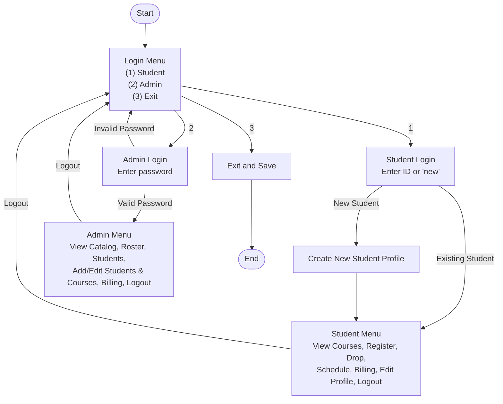

# unknownapp
This is an unknown application written in Java

---- For Submission (you must fill in the information below) ----
### Use Case Diagram

### Flowchart of the main workflow

### Prompts

1. as you a master in software construction and evolution, can you 4.	Create a flowchart (using Mermaid) to show the user's flow through the main menu. put it below of ### Flowchart of the main workflow on Readme.md. 